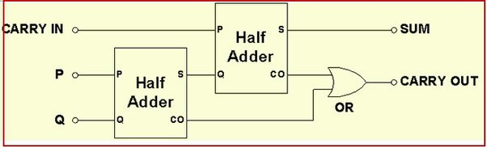
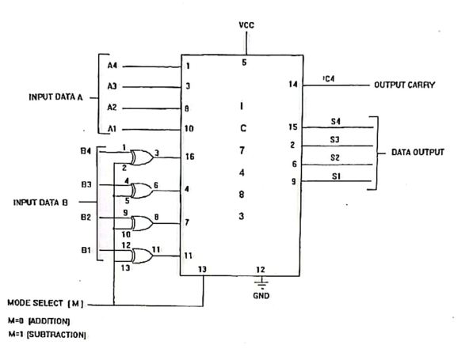
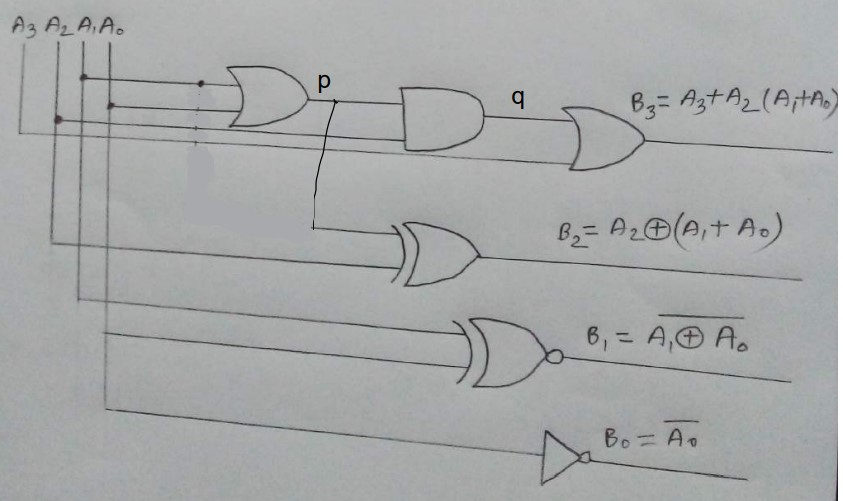
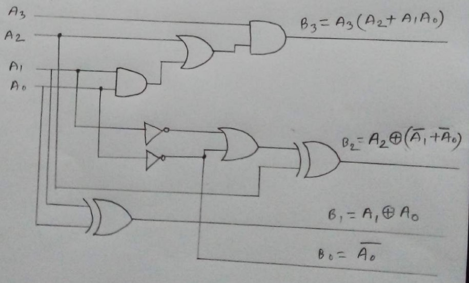
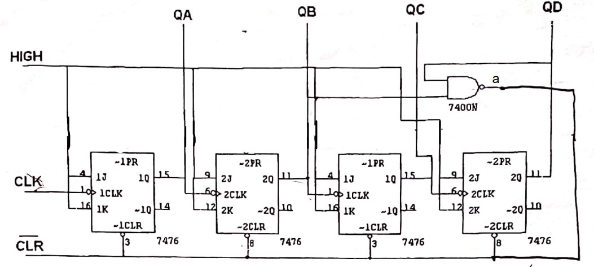
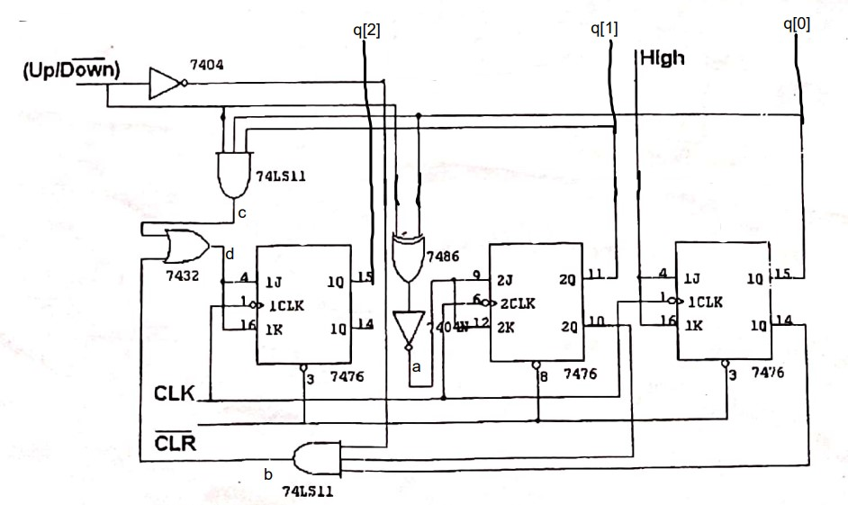
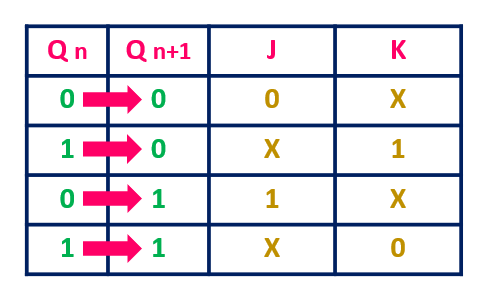

# Pre-caution
### Hardware
- Get a good trainer board.
- Check the clock.
- Check the wires.
- Check all ICs.
- You must supple ground, double check it before turning on the trainer board. If there is no ground the IC will burn immidiately. 
- Double check all wire connections when full implementation is finished.
### ModelSim
- Never freeze while forcing, always deposite the value
- At first set the clear to 0 for 1ms and run. Then set it to 1 and reset the runtime to 100ms
- If you have any varible you that doesn't have a default value you must deposite 0 in them while you are setting 0 to clear (while you are doing the previous point) 
# 1. Adder Subtractor 
### Half adder formula
```verilog
S = A xor B
C = A and B
```

### Full using half adder

### Full adder direct formla
```verilog
S = A xor B xor C 
C = AB + BC + AC
```
### Main Circuit

### Some Theory
- The when the mode is 1. It basically inverts the bits of B (which is 1's complement) and then also add the mode (which is 1) as a result the IC basically gets the 2's complement of B. 
### Verilog code
```verilog
module adder_subtractor(s, cout, a, b, mode);
    input [3:0] a, b;
    input mode;
    output [3:0] s;
    output cout;
    wire c0, c1, c2;
    full_adder fa1(s[0], c0, a[0], (b[0]^mode), mode);
    full_adder fa2(s[1], c1, a[1], (b[1]^mode), c0);
    full_adder fa3(s[2], c2, a[2], (b[2]^mode), c1);
    full_adder fa4(s[3], cout, a[3], (b[3]^mode), c2);
endmodule

module full_adder(s, cout, a, b, cin);
    input a, b, cin;
    output s, cout;
    xor(s, a, b, c);
    or(cout, a && b, b && c, c && a); 
endmodule
```

# 2. BCD to Excess 3
### Circuit Diagram & Formulas

### Verilog Code
```verilog
module bcd_to_excess_3(b, a);
	input [3:0] a;
	output [3:0] b;
	wire p, q;
	assign b[0] = ~a[0];
	xnor(b[1], a[1], a[0]);
	or(p, a[1], a[0]);
	xor(b[2], a[2], p);
	and(q, a[2], p);
	or(b[3], a[3], q);
endmodule
```

# 3. Excess 3 to BCD
### Circuit Diagram & Formula

### Verilog Code
```verilog
module excess_3_to_bcd(b, a);
	input [3:0] a;
	output [3:0] b;
	assign b[0] = ~a[0];
	xor(b[1], a[1], a[0]);
	xor(b[2], a[2], (~a[1] | ~a[0]));
	and(b[3], a[3], (a[2] | (a[1] & a[0])));
endmodule
```

# 4. Mod 10 Counter
### Circuit Diagram

### Some Theory
- Here A means lowest bit and D means highest bit.
- We know the binary of 10 is 1010, hence when the 4th and 2nd bit becomes high it clears the circuit to 0. Hence it becomes mod10 counter.
- When clock is zero it reset everything. When clock is 1. It does nothing. 
- All J & K are plugged in to VCC here.
### Verilog Code
```verilog
module mod_10_asyn_counter(q, clear, clk);
    input clear, clk;
    output [3:0] q;
    wire a;
    nand(a, q[1], q[3]);
    jk_flip_flop jk0(q[0],,1,1,(clear && a), clk);
    jk_flip_flop jk1(q[1],,1,1,(clear && a), q[0]);
    jk_flip_flop jk2(q[2],,1,1,(clear && a), q[1]);
    jk_flip_flop jk3(q[3],,1,1,(clear && a), q[2]);
endmodule

module jk_flip_flop(q, q_bar, j, k, clear, clk);
	input j, k, clear, clk;
	output q, q_bar;
	wire a, b, c, d, y, y_bar, c_bar;
	nand(a, q_bar, j, clk, clear);
	nand(b, k, clk, q);
	nand(c, a, d);
	nand(d, c, clear, b);
	not(c_bar, clk);
	nand(y, c, c_bar);
	nand(y_bar, d, c_bar);
	nand(q, y, q_bar);
	nand(q_bar, q, clear, y_bar);
endmodule
```

# 5. Up/Down Counter
### Circuit Diagram

### Formula
```
j[0] = 1;
k[0] = 1;
j[1] = ud xnor q[0];
k[1] = ud xnor q[0];
j[2] = (!q[0] && !q[1] && !ud) + (q[0] && q[1] && ud)
k[2] = (!q[0] && !q[1] && !ud) + (q[0] && q[1] && ud)
```
### Verilog Code
```verilog
module sync_up_down_counter(q, ud, clear, clk);
    input ud, clear, clk; //ud means up/down: 0=down, 1=up
    output [2:0] q;
    wire a, b, c, d;
    jk_flip_flop jk1(q[0],,1,1,clear,clk);
    xnor(a, ud, q[0]);
    jk_flip_flop jk2(q[1],,a,a,clear, clk);
    and(b, !q[1], !q[0], !ud);
    and(c, q[1], q[0], ud);
    or(d, b, c);
    jk_flip_flop jk3(q[2],,d,d,clear,clk);
endmodule
```

# 6. Sync Counter
### Some Theories
- You have to put the smallest value in cycle for the next state of a invalid state.
- The process is stated below.
    - First, you have to draw the curcuit diagram using JK exitation table
    - Draw the Kmap
    - Derive the curcuit and implement it.
### JK exitation table

